# ESThemes
A collection of Emulation Station Themes.

Based on original themes created by various creators and artists. Customized and enhanced for personal use. Fixed code formatting and removed un-necessary bits.

### Systems Supported

|All Games|Last Played|Favorites|Tools|Screenshots|
|---|---|---|---|---|
|Game&Watch|GameBoy|GBC|GBA|NDS|
|NES|SNES|N64|Gamecube|Wii|
|WiiU|Switch|3DS|PCEngine|NGP|
|PSX|PS2|PS3|PSP|PSVita|
|GameGear|MasterSystem|Genesis|Saturn|Dreamcast|
|PC|DOS|Xbox|Xbox360|Ports|
|Pico8|Tic80|openbor|Doom|ScummVM|
|Arcade|MAME|FB|Lightgun|Android|

## EpicNoir
Based on original [EpicNoir](https://github.com/c64-dev/es-theme-epicnoir) theme by [c64-dev](https://github.com/c64-dev)

### Changes
- Replaced broken system carousel with vertical wheel with system logos.
- Add distinct backgrounds & controllers for each system. No repetition or placeholder backgrounds anymore.
- Cleaner background for all gamelist views with minimal elements and a better color scheme.
- Replaced metadata in detailed view with what I consider as more useful info for a player.
- Added theme for clock in all views
- Update menu and other color schemes to match that of 351Noir.

### Screenshots

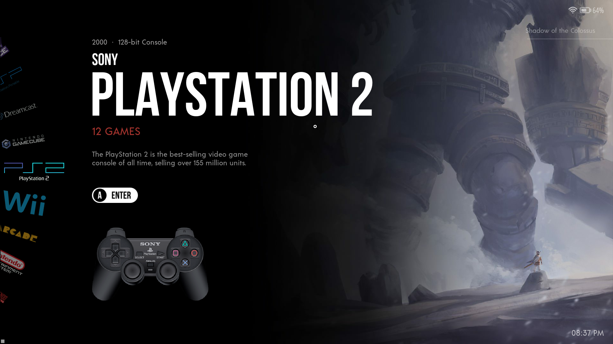 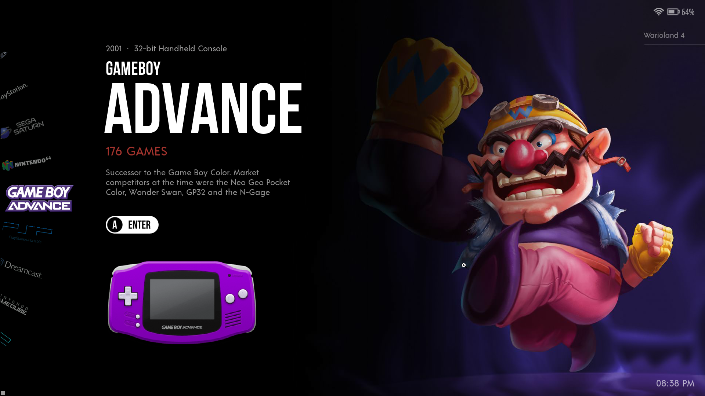

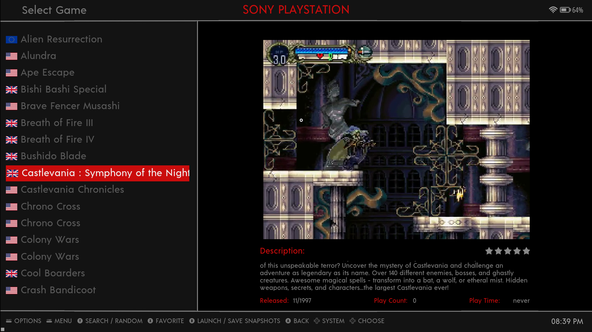 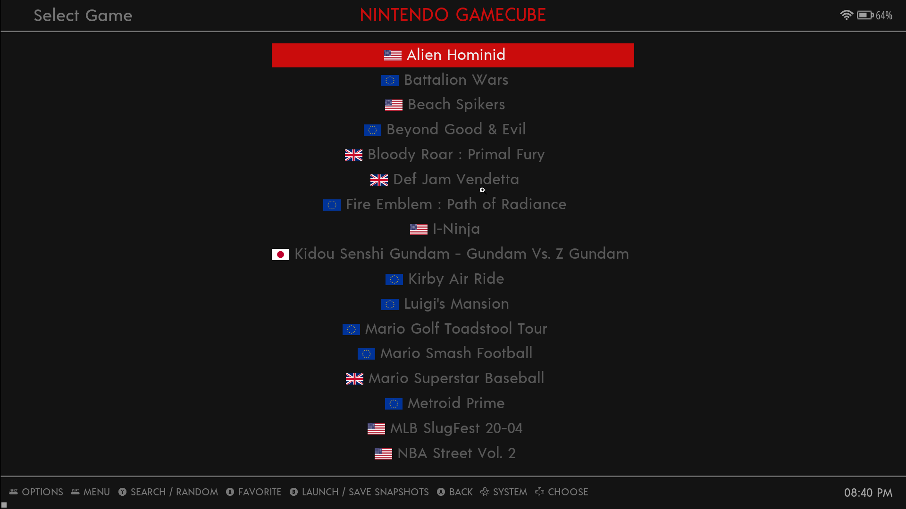

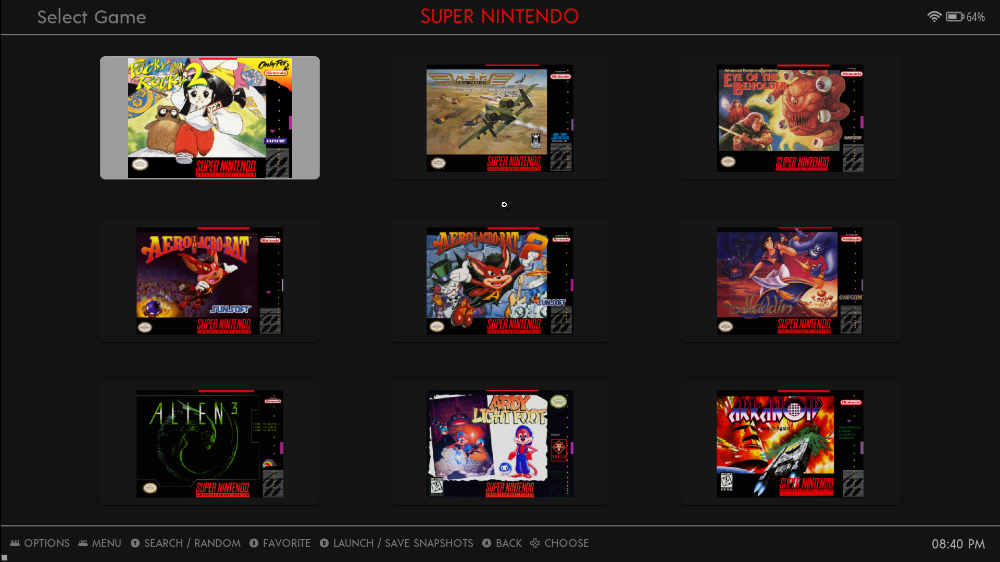 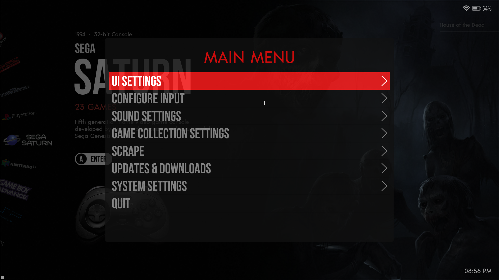

## 351Noir
Customised version of EpicNoir Theme for Anbernic's RG351p handheld running AmberElec firmware.

Based on [Amberelec-351Noir](https://github.com/SzalikDesigns/amberelec-351noir) by [Szalik](https://github.com/SzalikDesigns) and [kulvind3r](https://github.com/kulvind3r)

### Changes
None other than reduced system count and a small bug fix for grid gamelist view

I personally worked on Amberelec-351Noir so this fork is pretty much identical to the original. Just keeping it here in case i want to change something for my own need, like the reduced systems count to reduce theme size.

### Screenshots

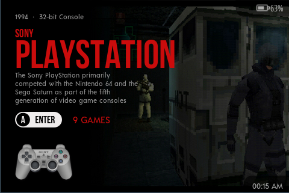 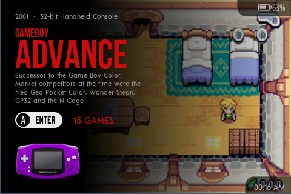

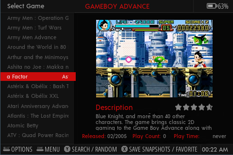 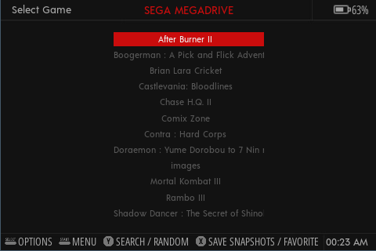

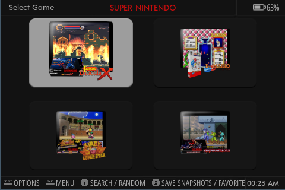 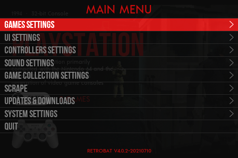

## How to Install
Download respective .zip files from the [latest release](https://github.com/kulvind3r/ESThemes/releases/latest) and extract the content to themes folder of Emulation Station

## License
This work is licensed under a [Creative Commons Attribution-NonCommercial-ShareAlike 4.0 International License](http://creativecommons.org/licenses/by-nc-sa/4.0/). \

